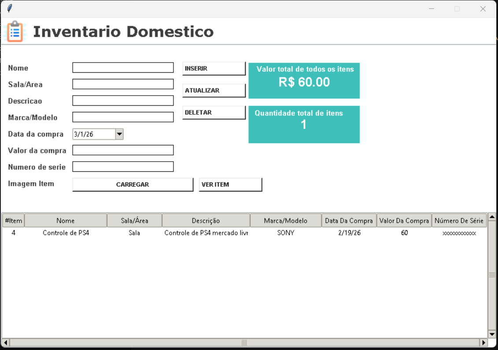

Inventário Doméstico

Sistema desktop desenvolvido em Python + Tkinter + SQLite para controle de bens domésticos.

Permite cadastrar, editar, visualizar e remover itens com imagem, data de compra e valor.

Funcionalidades-----

Cadastro de itens
Edição de informações
Remoção de registros
Upload e visualização de imagens
Controle de valor total dos bens
Contagem automática de itens
Interface gráfica simples e intuitiva

Interface-----

  

Tecnologias utilizadas----

Python
Tkinter
SQLite
Pillow

Melhorias futuras

Exportação em PDF
Sistema de login
Dashboard com gráficos

👨‍💻 Autor

 Bernardo Santana Barreto
[LinkedIn](https://www.linkedin.com/in/bernardo-barreto-aa1a20364/)

